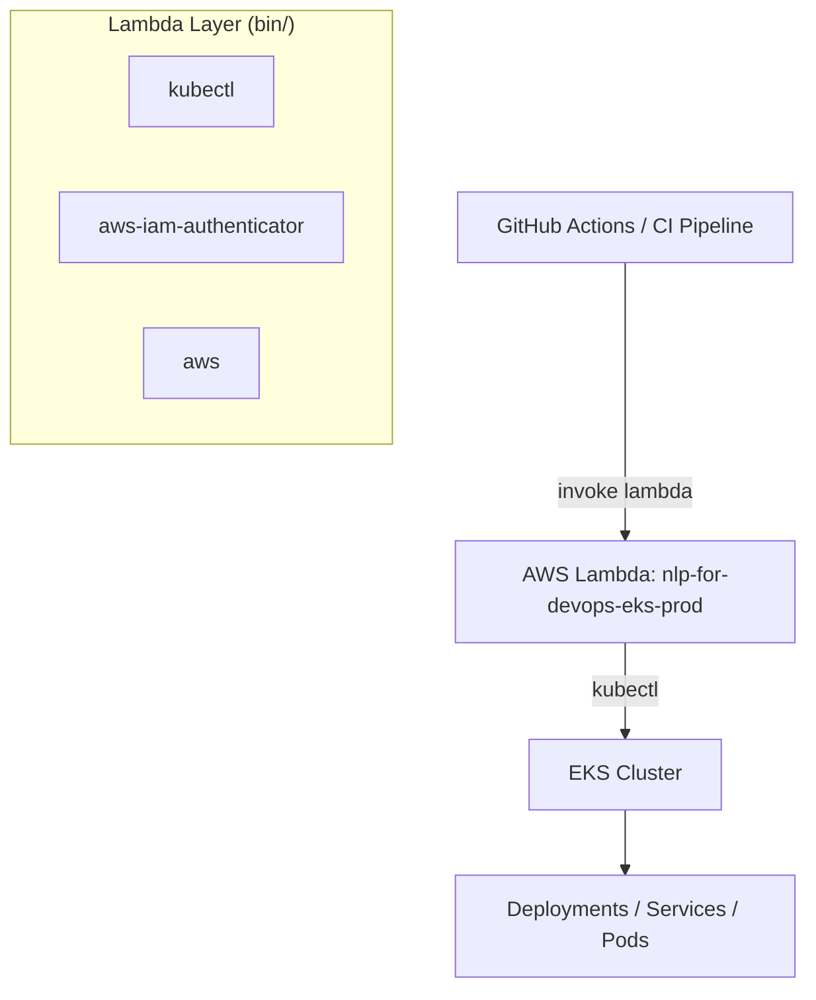

# Lambda-Driven EKS Deployment Controller

This repository contains a serverless Kubernetes control plane extension built using **AWS Lambda**, **EKS**, and a lightweight toolchain consisting of custom Lambda Layers (kubectl, aws-iam-authenticator, AWS CLI).  
The goal is to allow Lambda to securely execute `kubectl` commands inside an EKS cluster for **zero‑infrastructure deployments**, **GitHub Actions triggers**, and **ChatOps automation**.

---

##  Architecture Overview



---

##  Repository Structure

```
.
├── README.md
├── bin/                          # Lambda Layer binaries (not committed to GitHub)
│   ├── aws
│   ├── aws-iam-authenticator
│   ├── aws_completer
│   └── kubectl
├── bin.zip                       # Final zipped Lambda Layer (excluded from repo)
├── lambda/
│   ├── git-ci-logger.py          # Optional GitHub CI callback
│   └── nlp-for-devops-eks-prod.py # Main Lambda handler for kubectl execution
├── provision              # Script to create or configure the EKS cluster
└── yaml/
    ├── deployment-prod.yaml
    └── service-prod.yaml
```

>  **Note:** `bin/` and `bin.zip` should NOT be committed to GitHub.  
> These contain compiled binaries for Lambda Layers.

---

##  Requirements

- AWS Account with EKS + IAM permissions  
- EKS cluster already created (`django-cluster`)  
- kubectl, aws-iam-authenticator, AWS CLI v2 compiled for **x86_64 Linux**  
- Lambda runtime: **Python 3.12 or 3.14**

---

## Lambda Layer Setup (Critical Step)

Your Lambda needs a Layer containing:

```
bin/
├── kubectl
├── aws
├── aws-iam-authenticator
└── aws_completer
```

Zip the folder:

```sh
zip -r final_layerv3.zip bin/
```

Upload to Lambda as a new Layer.

---

## IAM Permissions for Lambda

Attach this IAM policy to your Lambda role:

### **EKS Access**
```json
{
  "Effect": "Allow",
  "Action": [
    "eks:DescribeCluster"
  ],
  "Resource": "*"
}
```

### **STS Access (needed for authenticator)**
```json
{
  "Effect": "Allow",
  "Action": [
    "sts:GetCallerIdentity"
  ],
  "Resource": "*"
}
```

---

## Add Lambda Execution Role to EKS (aws-auth)

Find your Lambda execution role by printing STS identity:

```python
import boto3
print(boto3.client("sts").get_caller_identity())
```

Example output:

```
arn:aws:sts::xxxxx:assumed-role/nlp-for-devops-eks-prod-role-xxxx/nlp-for-devops-eks-prod
```

So your role is:

```
arn:aws:iam::xxxxxxxxx:role/nlp-for-devops-eks-prod-role-xxxxxx
```

Add to EKS:

```sh
kubectl edit configmap aws-auth -n kube-system
```

Insert:

```yaml
- rolearn: arn:aws:iam::xxxxxxxxx:role/nlp-for-devops-eks-prod-role-xxxxxxxx
  username: lambda
  groups:
    - system:masters
```

Apply and validate:

```sh
kubectl get nodes
```

---

## How Lambda Authenticates to EKS

The kubeconfig created inside Lambda uses **aws-iam-authenticator**:

```yaml
users:
- name: lambda
  user:
    exec:
      command: /opt/bin/aws-iam-authenticator
      args:
        - "token"
        - "-i"
        - "django-cluster"
```

This produces temporary IAM‑based credentials, same as how `aws eks get-token` works.

---

## Example: Lambda Deployment REST API

Send event manually:

```json
{
  "action": "get",
  "namespace": "prod"
}
```

Or restart deployment:

```json
{
  "action": "restart",
  "namespace": "prod",
  "deployment": "django-app"
}
```

Or apply a YAML file:

```json
{
  "action": "apply",
  "yaml": "apiVersion: v1..."
}
```

---

## 🔄 GitHub Actions → Lambda Deployment Workflow

Example GitHub Actions snippet:

```yaml
deploy:
  runs-on: ubuntu-latest
  steps:
    - name: Trigger EKS Deployment Lambda
      uses: aws-actions/aws-lambda-invoke@v1
      with:
        function-name: nlp-for-devops-eks-prod
        payload: '{"action": "restart", "namespace": "prod", "deployment": "django-app"}'
```

---

## ☁️ provision_eks.sh

This script includes commands such as:

```sh
eksctl create cluster   --name django-cluster   --nodes 2   --region us-east-1
```
As well as helper steps for setting up OIDC, roles, and cluster configuration.

---
